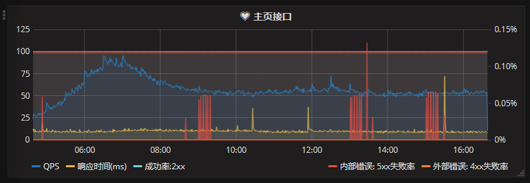

Fuck CSDN Keywords: 习近平 8964

## Java RestAPI 开发辅助功能

### 一、RestAPI请求监控

##### 功能

    通过Servlet Filter统计RestAPI请求响应时间与成功率,每分钟将统计的数据写入InfluxDB

##### 使用Grafana查看的效果图


#### 代码与配置

##### 1、初始化RequestLogFilter对象
```java
@Component
public class ServiceFactory {
    private ActorSystem system;   
    @PostConstruct
    private void init() {
        system = ActorSystem.apply();
    }
    @Bean
    ActorSystem createSystem() {
        return system;
    }
    @Bean(name="logFilter")
    RequestLogFilter createRequestLogFilter() {
        String dbUrl = "http://10.79.186.100:8086/write?db=demo"; //influxdb
        FuturedHttpClient httpClient = new FuturedHttpClient(system); 
        IRequestLogger reqLogger = new RequestLogger(dbUrl, httpClient);
        return new RequestLogFilterBuilder()
                .addIgnoreUri("/heartbeat")
                .setRequestGroupHeaderName("productId")
                .setRequestLogger(reqLogger)
                .build();
    }
}
```

##### 2、修改web.xml配置filter
```xml
<xml>
    <filter>
        <filter-name>logFilter</filter-name>
        <filter-class>org.springframework.web.filter.DelegatingFilterProxy</filter-class>
        <init-param>
            <param-name>targetFilterLifecycle</param-name>
            <param-value>true</param-value>
        </init-param>
        <async-supported>true</async-supported>
    </filter>
    <filter-mapping>
        <filter-name>logFilter</filter-name>
        <url-pattern>/*</url-pattern>
        <dispatcher>REQUEST</dispatcher>
        <dispatcher>ASYNC</dispatcher>
    </filter-mapping>
</xml>
```

##### 3、InfluxDB配置

新建数据库，设置保存时间为3天

    > create database "demo" with duration 3d replication 1
    > show retention policies on demo
    name    duration shardGroupDuration replicaN default
    ----    -------- ------------------ -------- -------
    autogen 72h0m0s  24h0m0s            1        true

手工插入一条数据，让新建的数据库生效（没有这一步，直接调用Influx的API插入数据不行）

    > use demo
    Using database demo
    > INSERT request,group=2000001,name=/api/home request=1,respond2xx=1,respond3xx=0,respond4xx=0,respond5xx=0,responedTime=10

### 二、Spring ExceptionHandler实现，异常时打印请求参数

```text
23:59:54.542 | DEBUG | Bad Request
status: 400
request: uri=/api/;client=10.79.183.10
params: 
  sv: 3.14.8.2
  imei: 861135032034365
  osv: 5.1
  dm: CUN-AL00
  nt: 0
  citycode: 0
headers: 
  x-ws-request-id: 5d8b8ef9_psygldlon4qc70_45403-9093
  content-type: application/json
  content-encoding: UTF-8
  user-agent: Apache-HttpClient/UNAVAILABLE (java 1.4)
  accept-encoding: gzip
  connection: close
 | BadRequest.handleException(141) | catalina-exec-124 | 
net.arksea.restapi.RestException: Bad Request
        at net.arksea.restapi.utils.influx.RequestLogFilter.getGroupNameAndDoFilter(RequestLogFilter.java:97) [restapi-influx-1.0.3-SNAPSHOT.jar:?]
        at net.arksea.restapi.utils.influx.RequestLogFilter.doFilter(RequestLogFilter.java:72) [restapi-influx-1.0.3-SNAPSHOT.jar:?]
        
```

##### 1、基本配置
在Spring自动扫描路径中定义RestExceptionHandler类
```java
@ControllerAdvice
public class RestExceptionHandler extends net.arksea.restapi.RestExceptionHandler {}
```

##### 2、4xx错误与5xx错误日志分别记录

RestExceptionHandler将4xx类的异常记录为Debug级别，使用的Logger name为net.arksea.restapi.logger.InternalError；
5xx类的异常记录为Warning级别，使用Logger name为net.arksea.restapi.logger.BadRequest
需要时可以将4xx异常写到独立的文件：

###### 修改log4j2.xml
```
...
<Logger name="net.arksea.restapi.logger.BadRequest" level="debug" additivity="false">
    <AppenderRef ref="badRequest"/>
</Logger>
...
```
